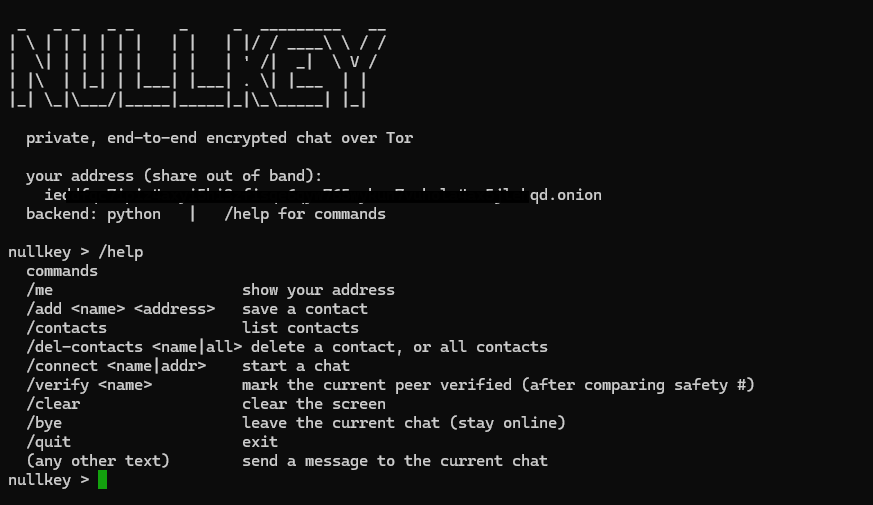
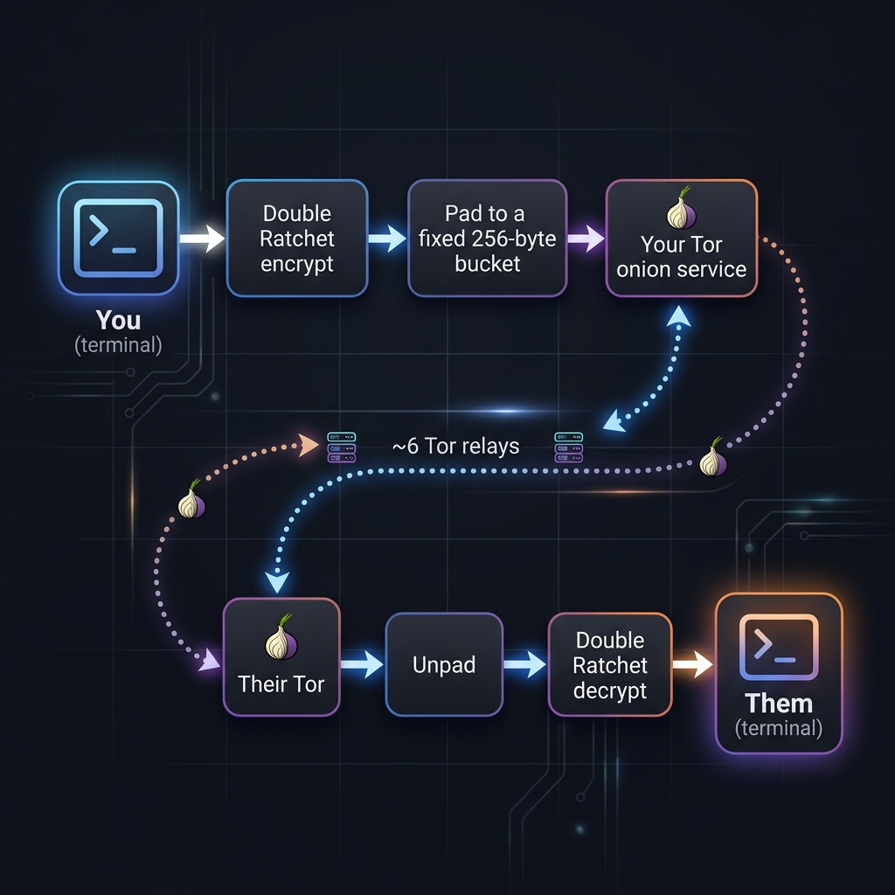

# Nullkey — a Tor-based encrypted chat (student build)


**Nullkey** is a tiny **1:1 end-to-end-encrypted chat** where each person is their own **Tor v3 onion service** — no server, no account, no phone number. It runs in the **terminal**. A student built it to learn how real private-messaging tools actually work.

📖 **[Get started + FAQ →](docs/GETTING-STARTED.md)**  ·  🧪 **[Tests + security →](docs/TESTING.md)**  ·  🔒 **[Threat model →](docs/SECURITY.md)**  ·  📚 [Glossary](docs/GLOSSARY.md) · [Learning path](docs/LEARNING-PATH.md) · [Design doc / PRD](docs/secure-messenger-prd.md)



---

## What it is

- **No server, no account.** There's no company in the middle. Two people connect directly, each running the app on their own machine.
- **Your address is your key.** Your identity is a Tor `.onion` address — a random-looking string that *is* your public key. No `-----BEGIN PGP-----` blob to leak.
- **End-to-end encrypted** with an X3DH-style handshake + a **Double Ratchet** (designed for forward secrecy — though it's a from-scratch, unaudited implementation).
- **Metadata-aware.** Everything runs inside **Tor**, message length is hidden by padding, and `--cover` adds decoy traffic.
- **Python + C++.** The app is Python; the crypto primitives and the risky message parser are also written in **C++/libsodium** (fuzzed + sanitized) for a systems-programming showcase.

## How it works

### The "how do I share my key?" problem (the original question)

- Your **onion address is your public key** — you just share a random-looking string, not an obvious crypto blob.
- You share it **out of band** (QR code / in person / short code) — which also blocks a man-in-the-middle.
- Everything runs **inside Tor**, which is designed so a network watcher can't see *who* you talk to. (A later phase adds a *pluggable transport* so they can't even tell you're using Tor.)

### A message's journey



### The crypto stack

| Layer | What Nullkey uses |
|---|---|
| Transport / anonymity | **Tor v3 onion services** (+ optional obfs4 bridge) |
| Handshake | X3DH-style **triple Diffie-Hellman** (X25519) — mixes both long-term + ephemeral keys |
| Session ratchet | **Double Ratchet** — forward secrecy + post-compromise security |
| Message encryption | **XChaCha20-Poly1305** (AEAD) |
| Key derivation | **HKDF-SHA256** / HMAC |
| Identity check | **safety number** (BLAKE2b over both identity keys), verified out of band |
| Metadata | fixed-size **padding** + **decoy/cover traffic** |

### Why a C++ core

A memory bug in a network **parser** can leak keys, so the parser is the piece most worth making memory-safe. Nullkey ports the primitives + the untrusted frame parser to **C++/libsodium** (exposed via `pybind11` as `nullkey_core`), proves it matches the Python reference **byte-for-byte**, and runs it under **ASan/UBSan + a fuzzer**. The app uses the C++ core when it's built and falls back to pure Python otherwise.

## Quick taste

```bash
python3 nullkey.py --local --data-dir ./peerA    # terminal 1
python3 nullkey.py --local --data-dir ./peerB    # terminal 2  (then: /add + /connect)
```

Full setup, the over-Tor flow, all commands, and the FAQ live in **[GETTING-STARTED.md](docs/GETTING-STARTED.md)**.

## Roadmap

| Phase | Goal | Language | Status |
|---|---|---|---|
| **0** | Onion-service 1:1 chat, X25519 + authenticated encryption, safety number | Python | ✅ (`chat.py`, reference prototype) |
| **1** | Persistent identity, symmetric peers, contacts, reconnect, real input line | Python | ✅ (`nullkey.py`) |
| **2** | X3DH-style handshake + **Double Ratchet** (forward secrecy) | Python | ✅ (`ratchet.py`) |
| **3** | **C++ core**: primitives + parser in C++/libsodium via pybind11; ASan/UBSan + fuzzer | **C/C++** | ✅ core (app runs on it) |
| **4** | Encrypted local store (Argon2id) + disappearing messages | Python/C++ | ⬜ optional |
| **5** | Metadata hardening: padding + decoy/cover traffic + obfs4 | Python | ✅ core (`wire.py`) |
| **6+** | Files → groups → GUI | — | ⬜ stretch |

## Project layout

| File / dir | Role |
|---|---|
| `nullkey.py` | the app (persistent identity, contacts, symmetric connect, terminal UI) |
| `chat.py` | Phase 0 reference prototype (`host`/`join`/`testhost`/`testjoin`) |
| `crypto.py` | framing + safety number + the X3DH-style `ratchet_handshake` |
| `ratchet.py` | the **Double Ratchet** (forward secrecy + post-compromise security) |
| `identity.py` · `contacts.py` · `net.py` · `wire.py` · `ui.py` | onion/long-term keys · contact book · Tor+SOCKS+retry · padding/decoys · ASCII banner |
| `cpp/` + `setup.py` | the **C++ core** (`core.cpp`, `bindings.cpp`, `asan_test.cpp`, `fuzz_frame.cpp`) |
| `test_*.py` · `fuzz_parser.py` · `nullkey.vp` | test suites · parser fuzzer · Verifpal model |
| `Makefile` · `.github/workflows/ci.yml` | one-word checks · CI |
| `docs/GETTING-STARTED.md` · `docs/TESTING.md` · `docs/SECURITY.md` | run + FAQ · tests + graphs · threat model |
| `docs/GLOSSARY.md` · `docs/LEARNING-PATH.md` · `docs/secure-messenger-prd.md` · `docs/PROGRESS.md` | terms · curriculum · design doc · changelog |

## License

[MIT](LICENSE) — do what you like, no warranty. (And see the disclaimer at the top: this is unaudited, educational software.)

## Security

Threat model + how to report a vulnerability: **[SECURITY.md](docs/SECURITY.md)**. Please **don't** open a public issue for security bugs.

## Responsible use

Encryption and anonymity tools are legitimate and legal in most places — this is privacy tech, in the same family as Briar and Cwtch. Build it to learn and to protect privacy, not to harm or target anyone.
