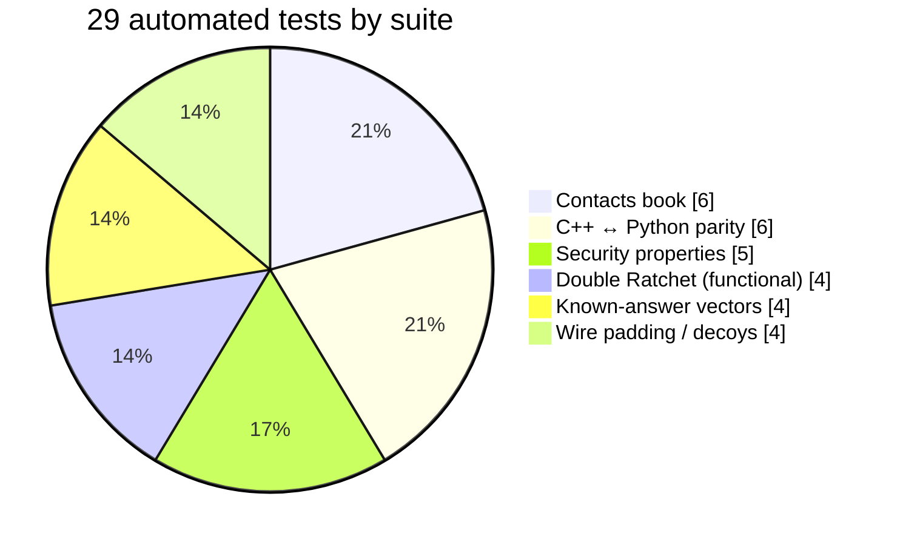
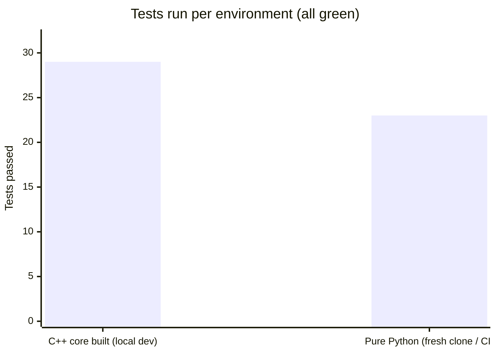

# Tests & security checks

> ⚠️ Educational, unaudited project. Passing every check below buys **confidence, not proof** — real assurance needs a professional audit and ideally audited crypto libraries. See [SECURITY.md](SECURITY.md).

Nullkey ships **29 automated tests** that pass on **both** crypto backends (the pure-Python path *and* the C++ core), plus fuzzing, sanitizers, and static/secret/dependency scans wired into CI.

## Run them yourself

```bash
pip install -r requirements-dev.txt   # pytest, bandit, ruff, pip-audit, detect-secrets
make test     # 29 unit + security tests
make all      # test + security lint + fuzz
make parity   # build the C++ core and prove it matches Python byte-for-byte
```

---

## 1. What the 29 tests cover

Every test grouped by suite — spread across the crypto, the contact book, the wire format, and C++↔Python parity.



| Suite | Tests | Checks |
|---|---:|---|
| `test_contacts.py` | 6 | add/get, name↔address resolve, verify + find-by-pubkey, persistence, `0600` file perms, delete/clear |
| `test_core_parity.py` | 6 | C++ core matches the Python reference **byte-for-byte** (safety number, HKDF, chain/message KDFs, header parse, AEAD both directions) |
| `test_security.py` | 5 | **forward secrecy**, **MITM detectable** via safety number, no key/nonce reuse, cross-session isolation, malformed-input robustness |
| `test_ratchet.py` | 4 | Double Ratchet: bidirectional + DH-ratchet rotation, out-of-order delivery, tamper caught, replay rejected |
| `test_vectors.py` | 4 | **known-answer tests** vs published standards: X25519 (RFC 7748), HKDF-SHA256 (RFC 5869), BLAKE2b, XChaCha20-Poly1305 |
| `test_wire.py` | 4 | fixed-size padding hides length; decoys are dropped and keep the ratchet in sync |

---

## 2. It works with *and* without the C++ core

The app dispatches to the C++ core when it's built, and falls back to pure Python otherwise — so a fresh clone (and CI) runs green even with no compiler. The 6 parity tests need the compiled core, so they **skip** (not fail) when it's absent.



*C++ core built → 29 passed. Pure Python → 23 passed, 6 parity tests skipped (they need the core; the CI `cpp-core` job builds it and runs them for real).*

---

## 3. Defense in depth — the full assurance pipeline

Unit tests are only the first layer. The parser is the real attack surface (a memory bug there leaks keys), so it also gets fuzzed and run under sanitizers, and the whole repo gets static, dependency, and secret scanning on every push.

```mermaid
flowchart LR
    code["Nullkey code<br/>crypto + parser"] --> u["Unit & property tests<br/>29 · pytest"]
    u --> k["Known-answer vectors<br/>vs RFC 7748 / 5869 + BLAKE2b"]
    k --> f["Fuzzing<br/>50,000 malformed frames"]
    f --> s["Sanitizers<br/>ASan + UBSan · 300,000 inputs"]
    s --> b["Static analysis<br/>bandit"]
    b --> d["Dependency CVEs<br/>pip-audit"]
    d --> g["Secret scan<br/>gitleaks · every push"]
    g --> v["Formal model<br/>Verifpal · nullkey.vp"]
    v --> ship["✅ confidence — not proof<br/>unaudited, educational"]
```



| Layer | Tool | What it throws at the code |
|---|---|---|
| Fuzzing | `make fuzz` / `fuzz_parser.py` | 50,000 malformed frames — the parser must never crash |
| Sanitizers | `make asan` | 300,000 random buffers through the C++ parser under ASan + UBSan — zero memory/UB errors |
| Static analysis | `make sec` → bandit | flags risky Python patterns (severity ≥ medium) |
| Dependencies | `make sec` → pip-audit | known CVEs in runtime deps — currently **none** |
| Secrets | gitleaks (CI) | blocks committed keys/tokens on every push |
| Formal | Verifpal (`nullkey.vp`) | checks the handshake *design* against an active attacker |

CI (`.github/workflows/ci.yml`) runs the test job, the C++ parity job, and the gitleaks secret scan on every push and pull request.

---

*Honest bottom line: this is a from-scratch, unaudited implementation. These checks catch a lot, but they are not a substitute for a professional security review. Don't trust Nullkey with anything real — [use Signal](https://signal.org).*
